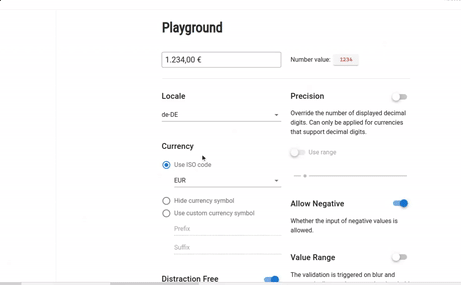

# Vue Currency Input

The Vue Currency Input component allows an easy input of currency formatted numbers. It provides both standalone component (`<currency-input>`) and a custom Vue directive (`v-currency`) for decorating existing input components with currency format capabilities.

## Table of contents

- [Browser Support](#browser-support)
- [Demo](#demo)
- [Features](#features)
- [Getting started](#getting-started)
- [Usage](#usage)
- [Available Props](#available-props)
- [Methods](#methods)
- [Directive options](#directive-options)
- [Want to Contribute?](#want-to-contribute)
- [Need Help / Support?](#need-help)
- [Collection of Other Components](#collection-of-components)
- [Changelog](#changelog)
- [Credits](#credits)
- [License](#license)
- [Keywords](#Keywords)

## Browser Support

 |  |  |  |  |
--- | --- | --- | --- | --- | --- |
83.0 ✔ | 77.0  ✔ | 13.1.1 ✔ | 83.0 ✔ | 11.9 ✔ |

## Demo

[](https://github.com/weblineindia/Vue-Currency-Input/currency-input.gif)

## Features

* Format as you type
* Locale dependent, ISO-compliant currency formatting
* Distraction free (hides the formatting on focus for easier input)
* Customizable currency symbols and precision ranges
* Built-in value range validation
* Works with input components of popular frameworks like [Vuetify](https://vuetifyjs.com/en/components/text-fields) or [Element](https://element.eleme.io/#/en-US/component/input))


## Getting started

Install the npm package:

``` bash
npm install vue-weblineindia-currency-input 
# OR 
yarn add vue-weblineindia-currency-input
```

## Usage

Add the Vue plugin in your `main.js`:
``` js
import Vue from 'vue'
import VueCurrencyInput from 'vue-weblineindia-currency-input'

Vue.use(VueCurrencyInput)
```

Use the `<vue-weblineindia-currency-input>` component:
``` vue
<template>
  <div>
  <currency-input v-model="value" currency="INR" locale="en-IN"/>
  </div>
</template>

<script>
export default {
  data: () => ({ value: 1000 })
}
</script>
```
## Available Props
Name | Type | Description
--- | --- | --- 
`value` | Number |  The value of the input. `v-model` is supported.
`currency` | String/Object | A [ISO 4217](https://en.wikipedia.org/wiki/ISO_4217) currency code (for example `USD` or `EUR`). Default is `EUR`. You can also pass an object `{prefix, suffix}` for customizing the currency symbol or `null` to hide the currency symbol permanently.
`locale` | String | A [BCP 47](https://tools.ietf.org/html/bcp47) language tag (for example `en` or `de-DE`). Default is `undefined` (use the runtime's default locale).
`auto-decimal-mode` | Boolean | Whether the decimal symbol is inserted automatically, using the last inputted digits as decimal digits. Default is `false` (the decimal symbol needs to be inserted manually).
`precision` | Number/Object | The number of displayed decimal digits. Default is `undefined` (use the currency's default). Must be between 0 and 20 and can only be applied for currencies that support decimal digits. You can also pass an object `{min, max}` to use a precision range (ranges are not available when using `auto-decimal-mode` or `value-as-integer`).
`distraction-free` | Boolean/Object | Whether to hide negligible decimal digits, the currency symbol and the grouping symbol on focus. Default is `true`. You can also pass an object of boolean properties to configure each option: `{hideNegligibleDecimalDigits, hideCurrencySymbol, hideGroupingSymbol}`. Using `false` will leave the formatted value untouched on focus.
`value-as-integer` | Boolean | Whether the number value should be handled as integer instead of float value. Default is `false`.
`value-range` | Object | The range of accepted values as object `{min, max}`. Default is `undefined` (no value range). The validation is triggered on blur and automatically sets the respective threshold if out of range.
`allow-negative` | Boolean | Whether the input of negative values is allowed. Default is `true`. If `false` it prevents the user to press <kbd>-</kbd>.
-----

### Methods
Name | Arguments | Description
--- | --- | --- 
`setValue` | `value` (Number) | Sets a value programmatically.

### Directive options
The `v-currency` directive supports the same options as the `<currency-input>` component which have to be passed as object:

Add the Vue plugin in your `main.js`:
``` js
import Vue from 'vue'
import VueCurrencyInput from 'vue-weblineindia-currency-input'

Vue.use(VueCurrencyInput)
```

Use the `v-currency`directive :

```vue
<template>
 <div>
  <input v-currency="{
   currency:'INR' ,
   locale:'en-IN'
  }"/>
  </div>
</template>
```

## Want to Contribute?

- Created something awesome, made this code better, added some functionality, or whatever (this is the hardest part).
- [Fork it](http://help.github.com/forking/).
- Create new branch to contribute your changes.
- Commit all your changes to your branch.
- Submit a [pull request](http://help.github.com/pull-requests/).

-----

## Need Help? 

We also provide a free, basic support for all users who want to use this VueJS Currency input in their software project. In case you want to customize this Currency input to suit your development needs, then feel free to contact our [VueJS developers](https://www.weblineindia.com/hire-vuejs-developer.html).

-----

## Collection of Components

We have built many other components and free resources for software development in various programming languages. Kindly click here to view our [Free Resources for Software Development](https://www.weblineindia.com/software-development-resources.html).

------

## Changelog

Detailed changes for each release are documented in [CHANGELOG.md](./CHANGELOG.md).

## Credits

vue-weblineindia-currency-input is inspired by the [vue-currency-input](https://www.npmjs.com/package/vue-currency-input).

## License

[MIT](LICENSE)

[mit]: https://github.com/weblineindia/Vue-Currency-Input/blob/master/LICENSE

## Keywords

vue-weblineindia-currency-input, vue, text mask, input mask, currency input, money input, currency input-field, input formatter, input field component, vue components, vuejs, vuejs component